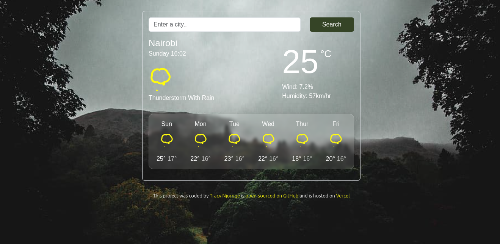

# My React Weather App Project

A React weather application that displays current weather and a 6-day forecast for any city using the SheCodes Weather API.

### React Weather App Screenshot

### Features

* Dynamic weather updates using SheCodes Weather API.
* Displays city name, weather icon, temperature, and daily forecast.
* Hosted on Vercel.

### Technologies

* HTML, CSS, JavaScript
* Axios for API requests
* React.js
* Bootstrap for styling

### Project Links

- Github Repository: [Repository](https://github.com/26TracyNjoroge/weather-react)
- Live Site URL: [Live Demo](https://shecodes-weather-react.vercel.app/)